

  
  <h2>GoMarks Web</h2>

  
A simple and powerful bookmark manager built with Go.

  

    
    
    
    
    
  

  
<i>🚧 Work in Progress</i>

## Podman | Docker

## Screenshots

### Index

|                 Main                  |                       Mobile                        |                           Mobile Search                           |
| :-----------------------------------: | :-------------------------------------------------: | :---------------------------------------------------------------: |
| 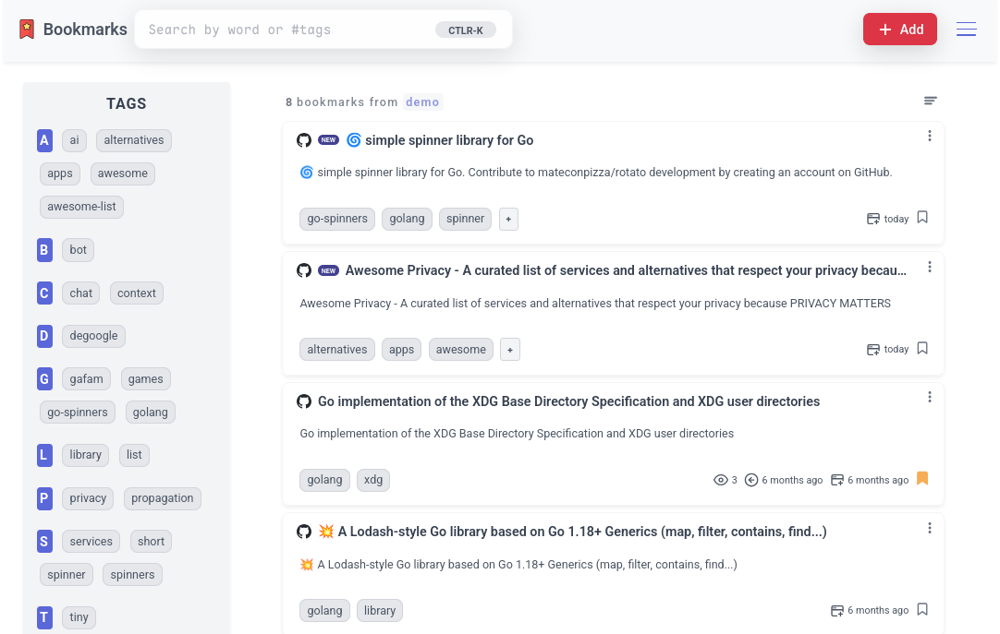 | 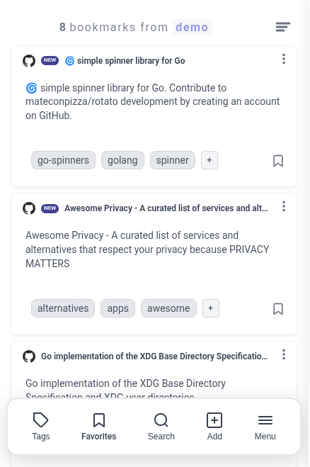 | 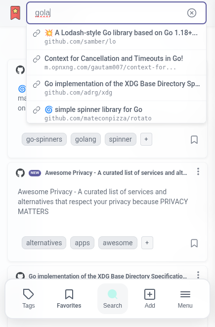 |

### Record

|                         Status                          |                     QRCode                      |                         Notes                         |
| :-----------------------------------------------------: | :---------------------------------------------: | :---------------------------------------------------: |
| 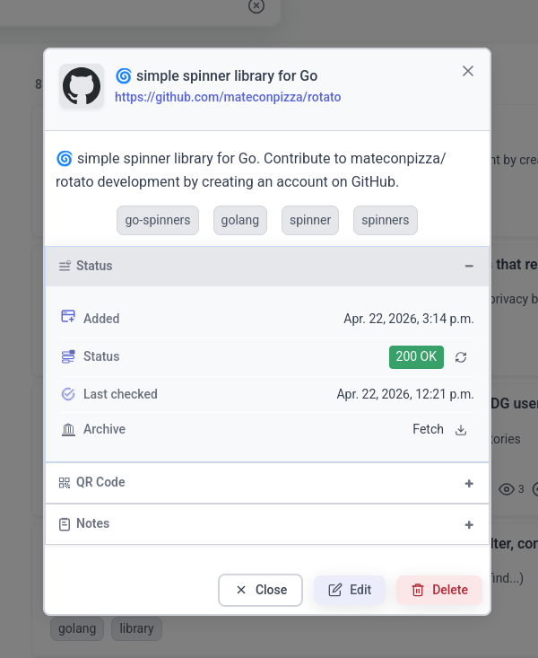 | 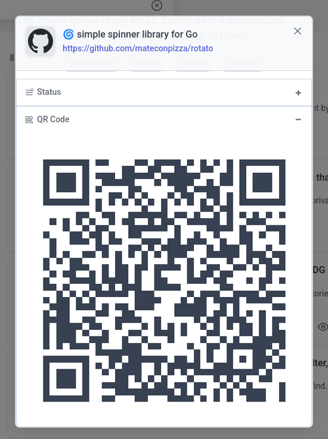 | 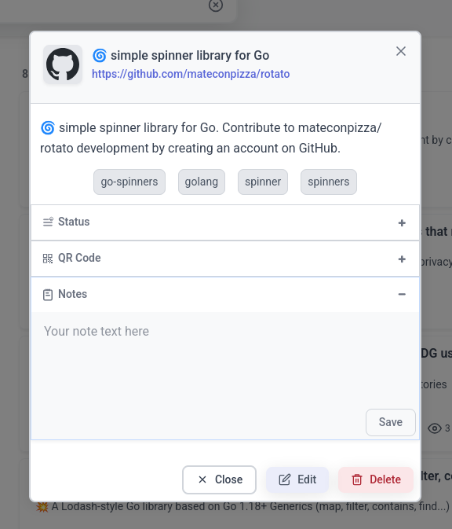 |

---

<strong>Settings</strong>

### Settings

|                   Settings                    |                  Themes                   |                    VIM Keybinds                    |
| :-------------------------------------------: | :---------------------------------------: | :------------------------------------------------: |
| 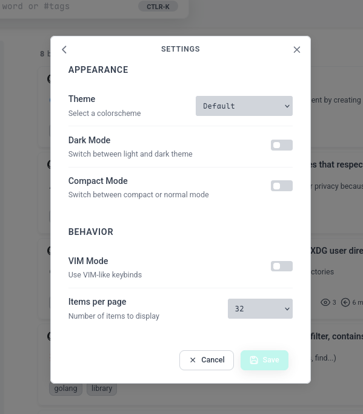 | 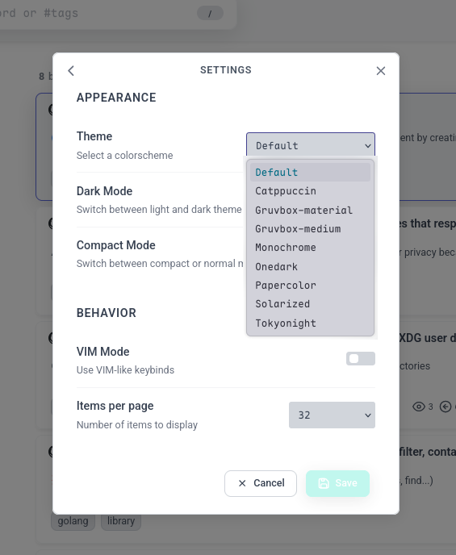 | 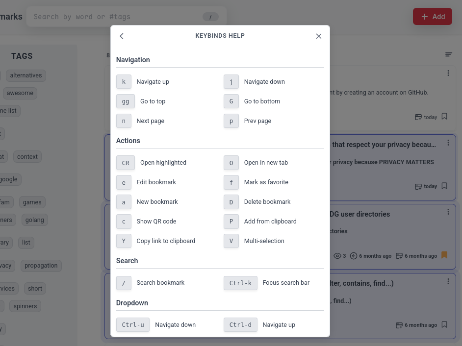 |

<strong>Repository</strong>

### Repository

|                     Repository                     |                      New                      |                      List                       |
| :------------------------------------------------: | :-------------------------------------------: | :---------------------------------------------: |
| 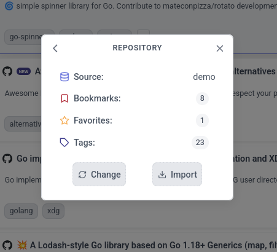 | 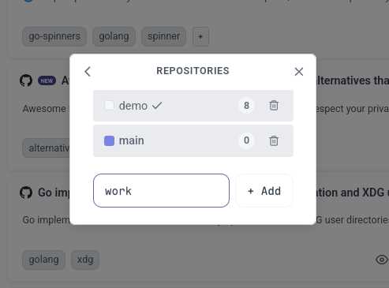 | 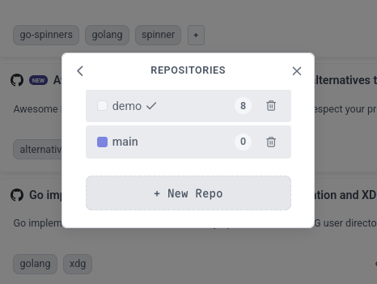 |

<strong>Routes</strong>

## API Routes

| Route pattern                     | Method | Handler        | Action                                              |
| --------------------------------- | ------ | -------------- | --------------------------------------------------- |
| /api                              | GET    | root           | returns app info                                    |
| /api/scrape                       | GET    | scrapeData     | scrapes data (URL, keywords, title, desc, favicon)  |
| /api/qr                           | POST   | genQR          | generates QR code from the given URL and size       |
| /api/qr/png                       | POST   | genQRPNG       | generates a PNG QR code from the given URL and size |
| /api/repo/list                    | GET    | dbList         | list available repositories                         |
| /api/repo/all                     | GET    | dbInfoAll      | returns repository info                             |
| /api/{db}/info                    | GET    | dbInfo         | returns repository info                             |
| /api/{db}/new                     | POST   | dbCreate       | create new repository                               |
| /api/{db}/delete                  | DELETE | dbDelete       | delete repository                                   |
| /api/{db}/bookmarks/tags          | GET    | allTags        | get all tags from the current repository            |
| /api/{db}/bookmarks/{id}/favorite | PUT    | toggleFavorite | toggle bookmark favorite status                     |
| /api/{db}/bookmarks/{id}/visit    | POST   | addVisit       | adds a visit to the URL                             |
| /api/{db}/bookmarks/new           | POST   | newRecord      | create a new record                                 |
| /api/{db}/bookmarks/{id}/update   | PUT    | updateRecord   | update a record                                     |
| /api/{db}/bookmarks/{id}/delete   | DELETE | deleteRecord   | delete a record                                     |

## Web Routes

| Route pattern                   | Method | Handler         | Action                      |
| ------------------------------- | ------ | --------------- | --------------------------- |
| /{$}                            | GET    | indexRedirect   | redirects to index          |
| /web/{db}/bookmarks/all         | GET    | index           | show all bookmarks          |
| /web/{db}/bookmarks/new         | GET    | newRecord       | new bookmark form           |
| /web/{db}/bookmarks/detail/{id} | GET    | recordDetail    | new bookmark form           |
| /web/{db}/bookmarks/edit/{id}   | GET    | recordEdit      | edit bookmark form          |
| /web/{db}/bookmarks/qr/{id}     | GET    | showQR          | show bookmark QRCode        |
| /static/                        | GET    | http.FileServer | static files (css, js, img) |
| /cache/                         | GET    | http.FileServer | favicons                    |

